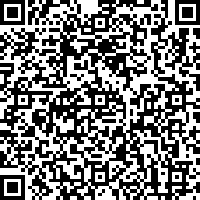
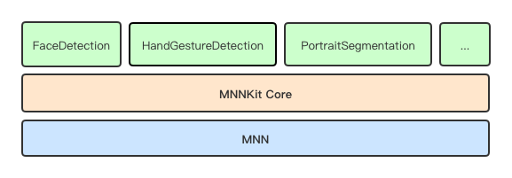
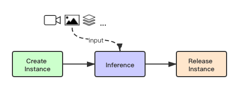
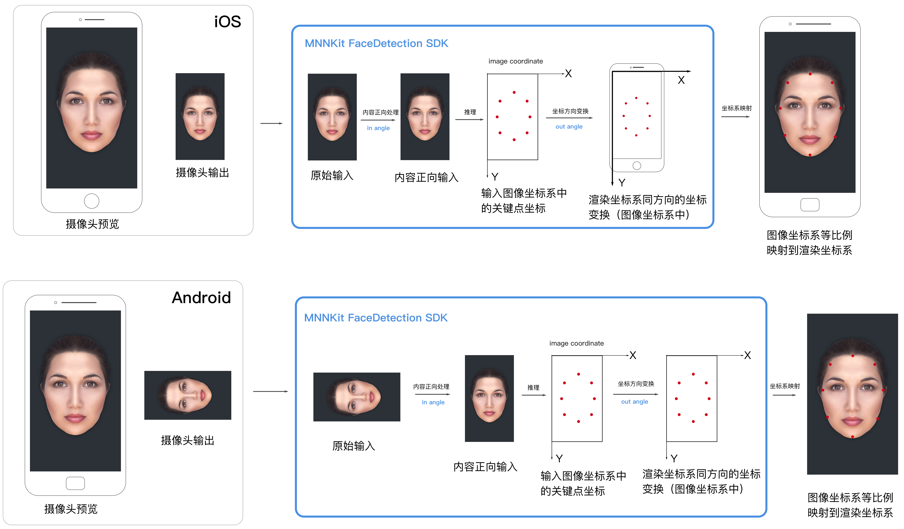

# MNNKit

## 简介

MNNKit是基于端上推理引擎[MNN](https://github.com/alibaba/MNN)提供的系列应用层解决方案，它是由MNN团队在阿里系应用大规模业务实践后的成熟方案，MNNKit主要面向Android/iOS移动应用开发者，使其能快速、方便地将通用场景的AI能力直接部署到移动应用中，从而基于它开发各种各样的业务能力和玩法。

- SDK开箱即用，接入方便，无需关心算法或模型
- 阿里系业务沉淀的稳定模型和算法，历经双十一等重大项目，端侧由MNN提供可靠的运行环境
- 高性能实时推理，不依赖于后端，更适合移动端应用场景

## Demo快速体验

### 1. 扫码安装

#### Android



### 2. 源码安装

```
git clone https://github.com/alibaba/MNNKit.git
```

#### Android

1. 打开Android Studio，点击File->Open...，选择MNNKitDemo/Android目录
2. Gradle sync成功后，点击Run安装运行到真机上（Demo中视频检测依赖摄像头输入）

#### iOS

```
cd MNNKitDemo/iOS
pod update
open MNNKitDemo.xcworkspace
```

然后安装运行到真机上（Demo中视频检测依赖摄像头输入）


## SDK安装

### Kit依赖关系

MNNKit SDK组织结构如下图：



从底向上分为三层：

1. MNN引擎层，是[MNN](https://github.com/alibaba/MNN)开源库在Android/iOS上编译好的二进制包的Relase版本，提供端侧AI运行的环境。
2. Core基础层，这一层主要抽象和封装与MNN c++接口调用粒度基本一致的上层API，iOS以OC接口提供，Android以Java接口提供（TODO）。同时也为上层SDK提供一些公共服务类或结构定义。
3. 业务Kit层，人脸检测、手势识别等都属于具体的一种算法能力在上层的封装，这一层的SDK称为业务Kit SDK，其中封装了若干模型和对应的算法处理。往后业务Kit层会不断扩展更多实用的Kit SDK。

### 安装

业务Kit层SDK相互独立，向下关联依赖无需显式指定，只需根据自身需求选择集成的SDK和版本即可。

| Kit SDK              | Android | iOS   |
| -------------------- | ------- | ----- |
| FaceDetection        | 0.0.2   | 0.0.1 |
| HandGestureDetection | 0.0.2   | 0.0.1 |
| PortraitSegmentation | 0.0.2   | 0.0.1 |

#### Android

- 系统最低API Level16（4.1版本）

```groovy
dependencies {
    implementation 'com.alibaba.android.mnnkit:facedetection:0.0.2'
    implementation 'com.alibaba.android.mnnkit:handgesturedetection:0.0.2'
    implementation 'com.alibaba.android.mnnkit:portraitsegmentation:0.0.2'
}
```

##### Proguard

```
-dontwarn com.alibaba.android.mnnkit.**
-keep class com.alibaba.android.mnnkit.**{*;}
```

#### iOS

- 系统最低版本ios 8.0

```ruby
source 'https://github.com/CocoaPods/Specs.git'
platform :ios

target 'MNNKitDemo' do
    platform :ios, '8.0'
    
    # 人脸检测
    pod 'MNNFaceDetection', '~> 0.0.1'
    # 手势识别
    pod 'MNNHandGestureDetection', '~> 0.0.1'
    # 人像分割
    pod 'MNNPortraitSegmentation', '~> 0.0.1'
    
end
```

##### Bitcode

目前MNNKit SDK均不支持bitcode，应用集成时候需关闭bitcode选项。


## API

Kit的基本API只有三个，创建实例、推理、释放实例。使用流程也是按照这个顺序，如下图所示，其中推理时可输入视频、图片或其他格式的数据。



[人脸检测API](doc/FaceDetection_CN.md)

[手势识别API](doc/HandGestureDetection_CN.md)

[人像分割API](doc/PortraitSegmentation_CN.md)


## 接入指南

MNNKit API中包含了inAngle和outAngle两个参数值，他们是用来做什么的？理解这个问题之前，我们不妨先了解下SDK处理的一般过程。

### 处理过程

如下是iOS和Android设备后置摄像头正向拍摄的场景，端上整个处理过程：



#### 1. 设备预览和输出

这部分是从Camera获取数据，作为SDK的输入；同时在设备前端，要正确的预览给用户。

#### 2. SDK检测

MNNKit SDK内部实现封装了算法的深度学习模型，运行在MNN引擎上，因此人脸检测也并非传统的图像处理，它有着机器学习所有的特性。算法在模型训练阶段使用的是正向的人脸数据集，因而这个模型只认识"正向"的人脸，如果输入是一张方向不对的人脸，可能就不会有检测结果，我们称之为"内容方向敏感"。MNNKit中人脸检测、手势识别、人像分割都属于"内容方向敏感"的类型。

1. 在MNN引擎执行推理之前，需要对原始的输入做预处理，保证输入数据中的人脸为正向
2. 推理完成后，产生了基于输入图像（预处理之后的）坐标系的关键点结果
3. 为了上层渲染方便，SDK会把关键点坐标变换到和屏幕渲染坐标系相同的方向

>  SDK参数中的inAngle参数就是用来控制将原始输入旋转到"内容正向"的角度，outAngle就是用来变换关键点坐标到屏幕渲染坐标系方向的角度！

从上图中可以看出，iOS在后置正向的情况下的输入角度为0，输出角度为0；而安卓输入角度为90，输出角度为0。

#### 3. 结果渲染

SDK检测的结果是图像的特征描述，最简单的描述就是关键点的坐标，这些坐标都是在图像坐标系下产生的，也就是在最终输入到引擎的图片左上角为原点的坐标系下。比如输入的图像是1280*720，那么检测结果也是在这个坐标系下产生。

工程应用中，最后的结果关键点要显示在用户屏幕上，前端会使用一个用来渲染的"画布"，它可以是一个UI上用来显示的视图或其他组件，画布的尺寸由应用根据视觉设计自己定义。画布的坐标系我们统称为渲染坐标系，这一步要做的就是将关键点坐标从头像坐标系转换到渲染坐标系。

在SDK检测的最后一步，我们已经将关键点变换到和渲染坐标系相同的方向，因为两个坐标系的大小不一样，接下来只需要等比例映射坐标就行了。映射完后直接渲染到画布上，就完成了整个过程。

### 工程实践参考

上述我们以iOS和Android设备后置摄像头正向拍摄为例阐述，比较简单，实际的工程接入中，摄像头的正向角度会产生输出图像的角度，设备旋转会造成输出图片非内容正向，自动旋转开启会引起渲染坐标系的变化，等等，这些都是SDK之外工程上需要解决的问题。

MNNKit Demo中涵盖了工程实践中所有问题的综合解法，如输入角度、摄像头预览、结果渲染、自动旋转等等，是工程接入的最佳实践参考。如果不熟悉该如何处理，请阅读Demo中的代码示例，相信所有的问题都可以迎刃而解。


## License

[MNN Kit Terms of Service](./MNN Kit Terms of Service 2019.12.19.docx)