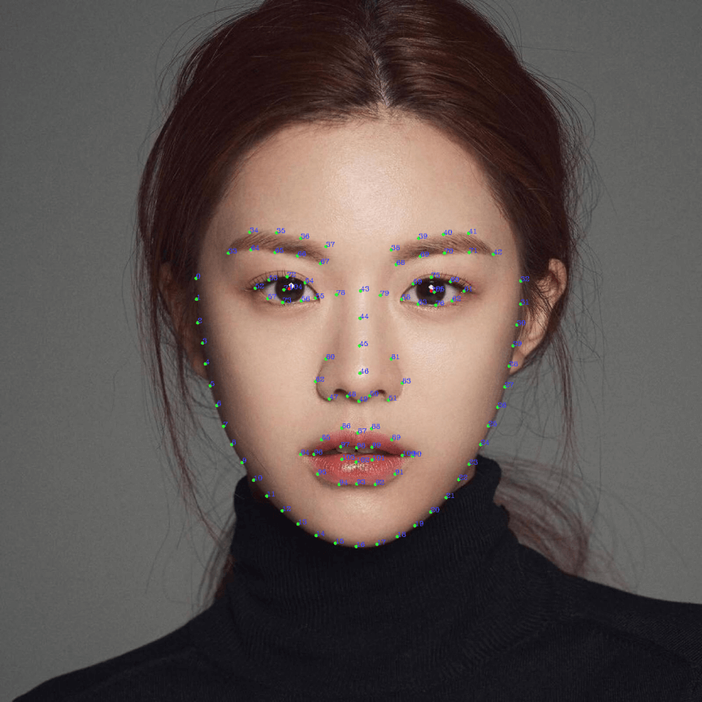
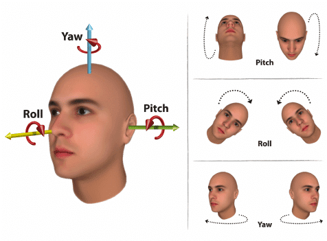

人脸检测是MNNKit提供的AI解决方案SDK，在端上提供了高精度、实时、功能丰富的人脸检测能力，能满足各种基于人脸检测的业务场景。

# 检测内容

### 1. 人脸基本信息

- 人脸位置的矩形坐标
- 106个关键点坐标（区分被遮挡的和未被遮挡的）
- 置信度

106个关键点的分布如下：



人脸各区域关键点分布对应表：


### 2. 欧拉角度

即摇头（Yaw）、点头（Pitch）、歪头（Roll）的三个角度值



### <span id="action">3. 人脸动作</span>

目前包含5个人脸动作：

1. 眨眼
2. 张嘴
3. 摇头
4. 点头
5. 扬眉

# API

## Android

### 1. 创建实例

异步创建FaceDetector实例，主线程中回调。

#### 参数

- context：上下文环境

- createConfig：创建时的配置参数，可用来配置是视频检测还是图片检测
- listener：创建完成后的回调

```java
public static void createInstanceAsync (Context context, FaceDetectorCreateConfig createConfig, InstanceCreatedListener<FaceDetector> listener)
```

> 人脸检测包含检测和跟踪两个动作，检测就是找到人脸的位置和关键点，跟踪就是人脸移动时重新定位关键点的位置。视频模式下并不是每一帧都检测，默认每20帧检测一次，其余帧只做跟踪，适合视频流输入的场景；而图片模式下每一次调用都会进行检测，适合图片检测的场景。

### 2.1 推理数据

通用数据的推理，支持多种数据格式输入。视频流检测场景中，可以使用摄像头的回调数据作为该接口的输入。

#### 参数

- data：输入的数据，如Camera回调的NV21数据
- width：数据宽
- height：数据高
- format：data的[数据格式](#format)
- detectConfig：[检测配置](#detectConfig)
- inAngle：输入角度，使输入图像顺时针旋转的角度，旋转后人脸变为正向，请参考接入指南&Demo示例
- outAngle：输出角度，使结果关键点变换坐标系的角度，方便上层渲染使用，请参考接入指南&Demo示例
- outputFlip：使结果关键点镜像类型，不镜像（FLIP_NONE）、沿X轴镜像（FLIP_X）、沿Y轴镜像（FLIP_Y）、中心镜像（FLIP_XY），请参考工程实践Demo示例

#### 返回值

检测对象，可能包含多个人脸的检测结果，详见FaceDetectionReport

```java
public synchronized FaceDetectionReport[] inference(byte[] data, int width, int height, MNNCVImageFormat format, long detectConfig, int inAngle, int outAngle,  MNNFlipType outputFlip)
```

### 2.2 推理图片

Bitmap检测接口，除了输入数据为bitmap，其余参数一样。

注意：*如检测单个图片，创建时需配置为图片检测模式*。

```java
public synchronized FaceDetectionReport[] inference(Bitmap bitmap, long detectConfig, int inAngle, int outAngle, MNNFlipType outputFlip)
```

### 3. 释放

FaceDetector实例用完之后需要手动释放，否则会产生native的内存泄露。

```java
public synchronized void release()
```

### 附：参数说明

#### <span id="format">支持输入的数据格式</span>

```java
public enum MNNCVImageFormat {
    RGBA(0),
    RGB(1),
    BGR(2),
    GRAY(3),
    BGRA(4),
    YUV_NV21(11);
  
    ...
}
```

#### <span id="detectConfig">detectConfig</span>

detectConfig用来配置人脸检测时需要关注哪些[动作](#action)，一般在视频检测模式中使用，因为动作检测需要连续几帧的信息。

detectConfig可以是如下值的或组合：

- FaceDetectConfig.ACTIONTYPE_EYE_BLINK

- FaceDetectConfig.ACTIONTYPE_MOUTH_AH

- FaceDetectConfig.ACTIONTYPE_HEAD_YAW

- FaceDetectConfig.ACTIONTYPE_HEAD_PITCH

- FaceDetectConfig.ACTIONTYPE_BROW_JUMP

如：

```java
long detectConfig = FaceDetectConfig.ACTIONTYPE_EYE_BLINK| FaceDetectConfig.ACTIONTYPE_MOUTH_AH|FaceDetectConfig.ACTIONTYPE_HEAD_YAW|FaceDetectConfig.ACTIONTYPE_HEAD_PITCH|FaceDetectConfig.ACTIONTYPE_BROW_JUMP;
```

检测值会在**FaceDetectionReport**的**faceActionMap**结果中输出，key为EyeBlink、MouthAh、HeadYaw、HeadPitch、BrowJump字符串，value为布尔值。比如我关心眨眼、张嘴、摇头这三个动作，就设置```FaceDetectConfig.ACTIONTYPE_EYE_BLINK| FaceDetectConfig.ACTIONTYPE_MOUTH_AH|FaceDetectConfig.ACTIONTYPE_HEAD_YAW```，那么检测器在推理时就会关注这三个动作，faceActionMap中会不断更新这三个动作是否被检测到：

```json
{"EyeBlink":false, "MouthAh":true, "HeadYaw":false}
```

##### FaceDetectionReport

```java
public class FaceDetectionReport {
    public static final int NATIVE_INT_OUT_LENGTH = 5;
    public static final int NATIVE_FLOAT_OUT_LENGTH = 322;

    // 划分int存储区域，一共5个
    public final Rect rect;                  ///< 代表面部的矩形区域
    public final int faceID;                 ///< faceID: 每个检测到的人脸拥有唯一的faceID.人脸跟踪丢失以后重新被检测到,会有一个新的faceID

    // 划分float存储区域，一共322个
    public final float[] keyPoints;          ///< 人脸106关键点的数组，依次为特征点1的坐标（X1, Y1），特征点2（X2, Y2）....
    public final float[] visibilities;       ///< 对应点的能见度,点未被遮挡1.0,被遮挡0.0

    public final float score;                ///< 置信度
    public final float yaw;                  ///< 水平转角,真实度量的左负右正
    public final float pitch;                ///< 俯仰角,真实度量的上负下正
    public final float roll;                 ///< 旋转角,真实度量的左负右正

    public long faceAction;                 // 脸部动作
    
  
    public Map<String, Boolean> faceActionMap; // 脸部动作Map
    ...
}
```


## iOS

### 1. 创建实例

异步创建MNNFaceDetector实例

#### 参数

- createConfig：创建时的配置参数，可用来配置是视频检测还是图片检测
- block：创建完成后的回调
- callbackQueue：指定回调的线程，如设置nil默认主线程中回调

```objective-c
+ (void)createInstanceAsync:(MNNFaceDetectorCreateConfig*)config Callback:(void(^)(NSError *error, MNNFaceDetector *faceDetector))block CallbackQueue:(dispatch_queue_t)callbackQueue;
```

默认主线程中回调，其他参数一样

```objective-c
+ (void)createInstanceAsync:(MNNFaceDetectorCreateConfig*)config Callback:(void(^)(NSError *error, MNNFaceDetector *faceDetector))block;
```

> 人脸检测包含检测和跟踪两个动作，检测就是找到人脸的位置和关键点，跟踪就是人脸移动时重新定位关键点的位置。视频模式下并不是每一帧都检测，默认每20帧检测一次，其余帧只做跟踪，适合视频流输入的场景；而图片模式下每一次调用都会进行检测，适合图片检测的场景。

### 2.1 推理（PixelBuffer输入）

使用系统相机作为输入检测时可使用该接口

#### 参数

- pixelBuffer：输入数据，CVPixelBufferRef格式
- detectConfig：检测配置
- inAngle：输入角度，使输入图像顺时针旋转的角度，旋转后人脸变为正向，请参考接入指南&Demo示例
- outAngle：输出角度，使结果关键点变换坐标系的角度，方便上层渲染使用，请参考接入指南&Demo示例
- flipType：使结果关键点镜像类型，不镜像（FLIP_NONE）、沿X轴镜像（FLIP_X）、沿Y轴镜像（FLIP_Y）、中心镜像（FLIP_XY），请参考工程实践Demo示例
- error：错误信息，如果是nil代表推理成功

#### 返回值

检测结果对象，可能包含多个人脸检测的结果

```objective-c
- (NSArray<MNNFaceDetectionReport *> *)inference:(CVPixelBufferRef)pixelBuffer Config:(MNNFaceDetectConfig)detectConfig Angle:(float)inAngle OutAngle:(float)outAngle FlipType:(MNNFlipType)flipType error:(NSError *__autoreleasing *)error;
```

### 2.2 推理（UIImage输入）

图片检测接口，除了输入数据为UIImage，其余参数一样。

注意：*如检测单个图片，创建时需配置为图片检测模式*。

```objective-c
- (NSArray<MNNFaceDetectionReport *> *)inferenceImage:(UIImage*)image Config:(MNNFaceDetectConfig)detectConfig Angle:(float)inAngle OutAngle:(float)outAngle FlipType:(MNNFlipType)flipType error:(NSError *__autoreleasing *)error;
```

### 2.3 推理（通用buffer数组输入）

通用数据的推理接口

#### 参数

- data：输入数据，通用数据表示为unsigned char数组
- w：数据宽
- h：数据高
- format：data的[数据格式](#format)
- detectConfig：检测配置
- inAngle：输入角度，使输入图像顺时针旋转的角度，旋转后人脸变为正向，请参考接入指南&Demo示例
- outAngle：输出角度，使结果关键点变换坐标系的角度，方便上层渲染使用，请参考接入指南&Demo示例
- flipType：使结果关键点镜像类型，不镜像（FLIP_NONE）、沿X轴镜像（FLIP_X）、沿Y轴镜像（FLIP_Y）、中心镜像（FLIP_XY），请参考工程实践Demo示例
- error：错误信息，如果是nil代表推理成功

#### 返回值

检测结果对象，可能包含多个人脸检测的结果

```objective-c
- (NSArray<MNNFaceDetectionReport *> *)inference:(unsigned char*)data Width:(float)w Height:(float)h Format:(MNNCVImageFormat)format Config:(MNNFaceDetectConfig)detectConfig Angle:(float)inAngle OutAngle:(float)outAngle FlipType:(MNNFlipType)flipType error:(NSError *__autoreleasing *)error;
```

### 3. 释放

MNNFaceDetector实例生命周期结束后会自动触发相关内存的释放，无需调用方手动释放


### 附：参数说明

#####支持输入的数据格式

```objective-c
typedef NS_ENUM(NSUInteger, MNNCVImageFormat) {
    RGBA = 0,
    RGB = 1,
    BGR = 2,
    GRAY = 3,
    BGRA = 4,
    YUV_NV21 = 11,
};
```

#### detectConfig

detectConfig用来配置人脸检测时需要关注哪些[动作](#action)，一般在视频检测模式中使用，因为动作检测需要连续几帧的信息。

detectConfig可以是如下值的或组合：

```objective-c
typedef NS_ENUM(NSUInteger, MNNFaceDetectConfig) {
    EYE_BLINK         = 1<<1,     ///< 眨眼
    MOUTH_AH          = 1<<2,     ///< 嘴巴大张
    HEAD_YAW          = 1<<3,     ///< 摇头
    HEAD_PITCH        = 1<<4,     ///< 点头
    BROW_JUMP         = 1<<5,     ///< 眉毛挑动
};
```

比如我关心眨眼、张嘴、摇头这三个动作，就设置：```MNNFaceDetectConfig detectConfig = EYE_BLINK|MOUTH_AH|HEAD_YAW;```，那么检测器在推理时就会关注这三个动作，MNNFaceDetectionReport的faceAction中会不断更新这三个动作是否被检测到。提取的时候可以使用按位与来获取每个动作的检测结果：

```objective-c
if ((faceAction & EYE_BLINK)!=0) {
  // 检测到眨眼
}
if ((faceAction & MOUTH_AH)!=0) {
  // 检测到嘴巴大张
}
if ((faceAction & HEAD_YAW)!=0) {
  // 检测到摇头
}
if ((faceAction & HEAD_PITCH)!=0) {
  // 检测到点头
}
if ((faceAction & BROW_JUMP)!=0) {
  // 检测到眉毛挑动
}
```

#### MNNFaceDetectionReport

```objective-c
@interface MNNFaceDetectionReport : NSObject

// 5
@property (nonatomic, assign) CGRect rect;               // 面部表情区域
@property (nonatomic, assign) NSInteger faceId;          // 每个检测到的人脸拥有唯一的faceID。人脸跟踪丢失以后重新被检测到，会有一个新的faceID

// 322
@property (nonatomic, assign) CGPoint *keyPoints;        // 人脸106关键点的数组
@property (nonatomic, assign) CGFloat *visibilities;     // 对应点的能见度，点未被遮挡1.0，被遮挡0.0
@property (nonatomic, assign) CGFloat score;              // 置信度
@property (nonatomic, assign) CGFloat yaw;                // 水平转角，真实度量的左负右正
@property (nonatomic, assign) CGFloat pitch;              // 俯仰角，真实度量的上负下正
@property (nonatomic, assign) CGFloat roll;               // 旋转角，真实度量的左负右正

@property (nonatomic, assign) unsigned long faceAction;   // 人脸动作

@end
```
